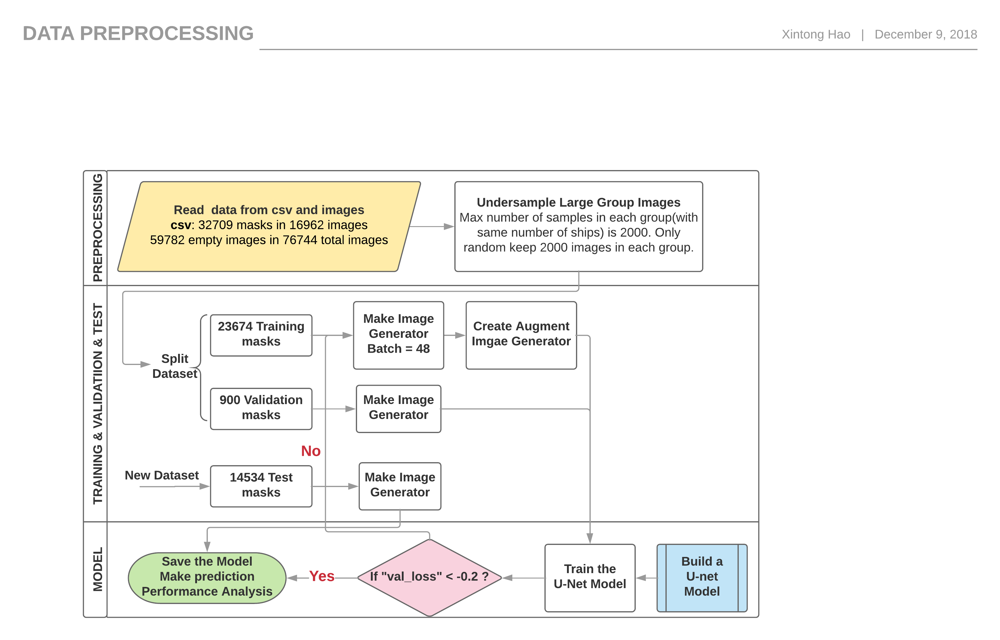

# Machine-Learning-Project
[Airbus Ship Detection Challenge](https://www.kaggle.com/c/airbus-ship-detection)

In this project, we are going to locate ships in images, and show segment mask around the ships we locate. Many images do not contain ships, and those that do may contain multiple ships. Ships within and across images may differ in size (sometimes significantly) and be located in open sea, at docks, marinas, etc.

### Project Diagram

__Procedure description__: 

1. Read data from csv file and image dataset and do undersampling on empty images. 
2. Split dataset into 70% training set, 15% validation set and 15% test set. 
3. Generate image pixel array on all sets and generate augment on training set to get the feature X. 
4. Train the model using feature X and target y from training set. 
5. Check validation loss using validation set. If the loss (IoU metric) is higher than -0.2, keep training using next 48 images. Else, save the model and make predictions on test set. 
